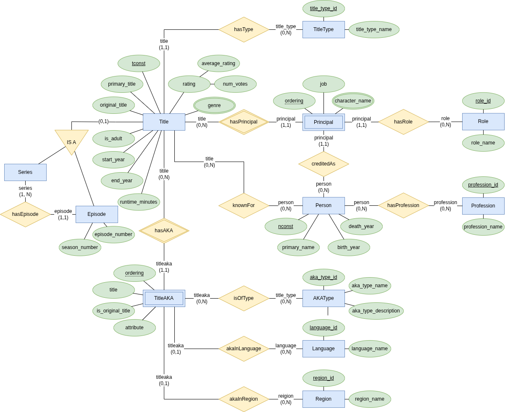

# CineExplorer — INFO9014 Knowledge Representation and Reasoning

**Course:** INFO9014 — Knowledge Representation and Reasoning, Prof. Christophe Debruyne, ULiège
**Team:** Dawid RACZKOWSKI (s200735) · Hoang Linh BUI (s2503303) · Duy Vu DINH (s2401627)

---

## Overview

CineExplorer is a knowledge graph platform built on top of a sampled IMDb relational dataset. It integrates a formal OWL 2 QL ontology (with cardinality validation handled by SHACL shapes), an R2RML mapping to generate RDF triples, and a SPARQL-queryable triplestore. The platform supports actor connectivity analysis (Bacon-number paths), Wikidata federation for entity enrichment, and graph-driven exploration of films, series, persons, and genres.

---

## Repository Structure

```
info9014-krr-project/
│
├── database/                    # M1 — Source relational database
│   ├── docker-compose.yml       #   MySQL 8 (port 3307) + phpMyAdmin (port 8080)
│   ├── imdb-schema.sql          #   DDL + LOAD DATA INFILE
│   ├── sources/                 #   16 TSV source files (IMDb non-commercial sample)
│   └── README.md
│
├── ontology/                    # M2 — OWL 2 QL ontology
│   └── cineexplorer_ontology.ttl
│
├── mapping/                     # M3 — R2RML mapping
│   ├── cineexplorer_mapping.ttl
│   └── mapping.properties       #   JDBC connection + I/O paths
│
├── tools/r2rml/                 # R2RML processor (r2rml.jar + dependencies)
│
├── output/                      # Generated knowledge graph
│   └── cineexplorer_kg.ttl      #   15,495 triples · 2,229 subjects
│
├── sparql/                      # M4 — SPARQL query files
│   ├── q01_films_genres.sparql
│   ├── ...
│   └── results/                 #   Query result exports
│
└── deployment/                  # M4 — Apache Fuseki triplestore
    └── docker-compose.yml       #   Fuseki (port 3030)
```


---

## Quick Start

### 1 — Start the source database

```bash
cd database && docker compose up -d
# phpMyAdmin available at http://localhost:8080
```

### 2 — Regenerate the knowledge graph (requires database running)

```bash
cd mapping && java -jar ../tools/r2rml/r2rml.jar mapping.properties
# Output: output/cineexplorer_kg.ttl
```

### 3 — Deploy the triplestore (M4)

```bash
cd deployment && docker compose up -d

# Create dataset (once)
curl -u admin:admin -X POST http://localhost:3030/$/datasets \
  -d "dbName=cineexplorer&dbType=tdb2"

# Load ontology
curl -u admin:admin -X POST http://localhost:3030/cineexplorer/data \
  --data-binary @ontology/cineexplorer_ontology.ttl \
  -H "Content-Type: text/turtle"

# Load knowledge graph
curl -u admin:admin -X POST http://localhost:3030/cineexplorer/data \
  --data-binary @output/cineexplorer_kg.ttl \
  -H "Content-Type: text/turtle"

# SPARQL endpoint: http://localhost:3030/cineexplorer/query
# Web UI:          http://localhost:3030
```

### 4 — Verify the knowledge graph

```bash
python3 -c "
from rdflib import Graph, Namespace, RDF, RDFS
CE = Namespace('http://cineexplorer.local/ontology#')
g = Graph(); g.parse('output/cineexplorer_kg.ttl', format='turtle')
print(f'Total triples: {len(g)}')
for cls in ['Film','Series','Episode','Person','Genre','Participation']:
    print(f'  {cls}: {len(list(g.subjects(RDF.type, CE[cls])))}')
"
```

---

## Ontology

- **Namespace:** `http://cineexplorer.local/ontology#` (prefix `ce:`)
- **Instance IRIs:** `http://cineexplorer.local/data/{title|person|genre|participation}/{id}`
- **Profile:** OWL 2 QL — confirmed with Protégé's OWL Profile Checker; consistency verified with HermiT reasoner in Protégé 5.6.9
- **Key classes:** `CreativeWork` → {`Film`, `Series`, `Episode`} (disjoint); `Person` → {`Actor`, `Director`, `Writer`, `Editor`, `Composer`}; `Genre`; `Participation`

---

## Entity-Relationship Diagram (M1)

<div style="display: flex; justify-content: space-around; align-items: center;">
    
</div>

---

## References

[1] IMDb. *IMDb Non-Commercial Datasets*. https://developer.imdb.com/non-commercial-datasets/

[2] northCoder. *Sample IMDb data for relational databases*. https://github.com/northcoder-repo/relational-sample-imdb-data

[3] R. Cyganiak, A. Das, J. Sequeda. *R2RML: RDB to RDF Mapping Language*. W3C Recommendation, 2012. https://www.w3.org/TR/r2rml/

[4] L. Sauermann, R. Cyganiak. *Cool URIs for the Semantic Web*. W3C Interest Group Note, 2008. https://www.w3.org/TR/cooluris/
